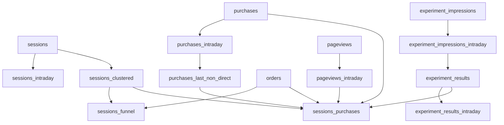

# Documentação do Projeto

## Tabelas Granulares

### Sessões e Tráfego
- [Sessions](granular/sessions.md) - Dados de sessões e fontes de tráfego
- [Sessions Intraday](granular/sessions_intraday.md) - Dados de sessões em tempo real e últimos 90 dias
- [Pageviews](granular/pageviews.md) - Visualizações de página e interações
- [Pageviews Intraday](granular/pageviews_intraday.md) - Visualizações de página em tempo real

### Transações
- [Orders](granular/orders.md) - Informações detalhadas de pedidos do e-commerce
- [Purchases](granular/purchases.md) - Eventos de compra do Google Analytics
- [Purchases Intraday](granular/purchases_intraday.md) - Eventos de compra em tempo real e últimos 90 dias

### Experimentos
- [Experiment Impressions](granular/experiment_impressions.md) - Impressões de experimentos A/B
- [Experiment Impressions Intraday](granular/experiment_impressions_intraday.md) - Impressões de experimentos em tempo real

## Tabelas de Join

### Análise de Sessões
- [Sessions Clustered](join/sessions_clustered.md) - Sessões classificadas por produto, campanha e UTMs normalizados
- [Sessions Funnel](join/sessions_funnel.md) - Funil de conversão de sessões com classificação de páginas
- [Sessions Purchases](join/sessions_purchases.md) - Combinação de sessões com dados de compra e steps do funil

### Análise de Compras
- [Purchases Last Non Direct](join/purchases_last_non_direct.md) - Atribuição de compras à última sessão não-direta

### Análise de Experimentos
- [Experiment Results](join/experiment_results.md) - Resultados consolidados dos experimentos A/B
- [Experiment Results Intraday](join/experiment_results_intraday.md) - Resultados de experimentos em tempo real

## Estrutura do Projeto 

```
docs/
├── README.md
├── granular/
│   ├── sessions.md
│   ├── sessions_intraday.md
│   ├── orders.md
│   ├── purchases.md
│   ├── purchases_intraday.md
│   ├── pageviews.md
│   ├── pageviews_intraday.md
│   ├── experiment_impressions.md
│   └── experiment_impressions_intraday.md
└── join/
    ├── sessions_clustered.md
    ├── sessions_funnel.md
    ├── sessions_purchases.md
    ├── purchases_last_non_direct.md
    ├── experiment_results.md
    └── experiment_results_intraday.md
```

## Visão Geral das Dependências



## Atualizações Recentes

### Granular
- **Sessions Intraday**: Adicionado união com últimos 90 dias de dados históricos
- **Purchases Intraday**: Adicionado união com últimos 90 dias de dados históricos
- **Experiment Impressions**: Novo modelo para tracking de experimentos A/B
- **Pageviews**: Novo modelo para análise de visualizações de página

### Join
- **Sessions Clustered**: 
  - Atualização na classificação de páginas
  - Novos produtos adicionados (Mamãe Sarada 40+, Indique e Ganhe, etc.)
  - Melhorias na normalização de UTMs
- **Sessions Purchases**:
  - Adicionado novos steps do funil (login, billet, plans_carol_borba)
  - Novos produtos para tracking de vendas
  - Filtros aprimorados para ambientes de desenvolvimento
- **Experiment Results**:
  - Novo modelo para análise de resultados de experimentos
  - Métricas de conversão e engajamento por variante 