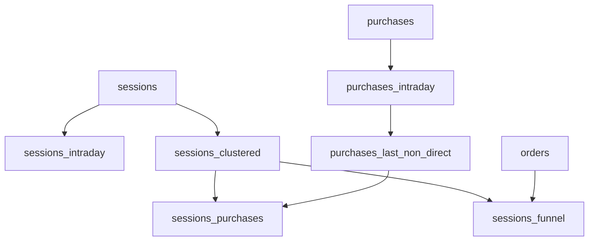

# Documentação do Projeto

## Tabelas Granulares

### Sessões e Tráfego
- [Sessions](granular/sessions.md) - Dados de sessões e fontes de tráfego
- [Sessions Intraday](granular/sessions_intraday.md) - Dados de sessões em tempo real

### Transações
- [Orders](granular/orders.md) - Informações detalhadas de pedidos
- [Purchases](granular/purchases.md) - Eventos de compra do Google Analytics
- [Purchases Intraday](granular/purchases_intraday.md) - Eventos de compra em tempo real

## Tabelas de Join

### Análise de Sessões
- [Sessions Clustered](join/sessions_clustered.md) - Sessões classificadas por produto e campanha
- [Sessions Funnel](join/sessions_funnel.md) - Funil de conversão de sessões
- [Sessions Purchases](join/sessions_purchases.md) - Combinação de sessões com dados de compra

### Análise de Compras
- [Purchases Last Non Direct](join/purchases_last_non_direct.md) - Atribuição de compras à última sessão não-direta

## Estrutura do Projeto 

```
docs/
├── README.md
├── granular/
│   ├── sessions.md
│   ├── sessions_intraday.md
│   ├── orders.md
│   ├── purchases.md
│   └── purchases_intraday.md
└── join/
    ├── sessions_clustered.md
    ├── sessions_funnel.md
    ├── sessions_purchases.md
    └── purchases_last_non_direct.md
```

## Visão Geral das Dependências

